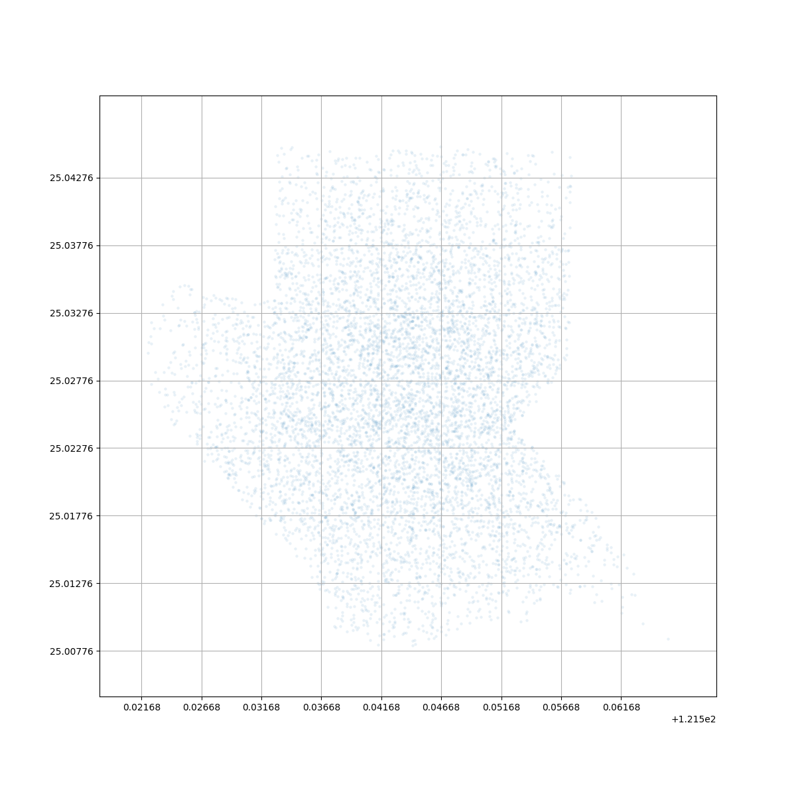
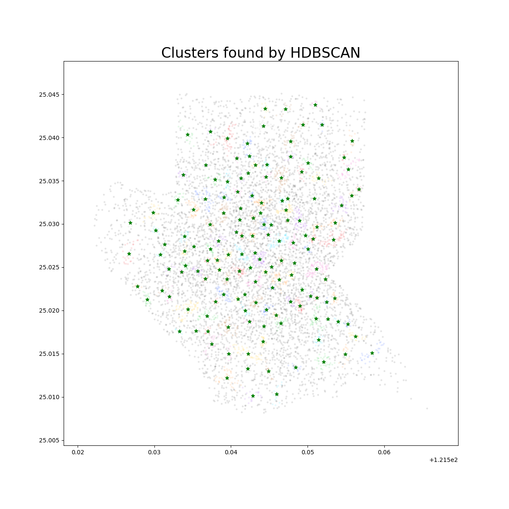
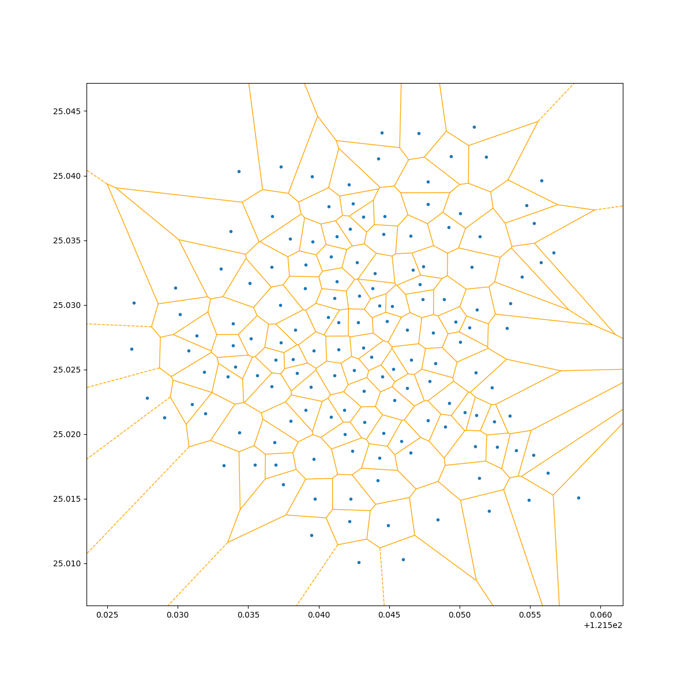
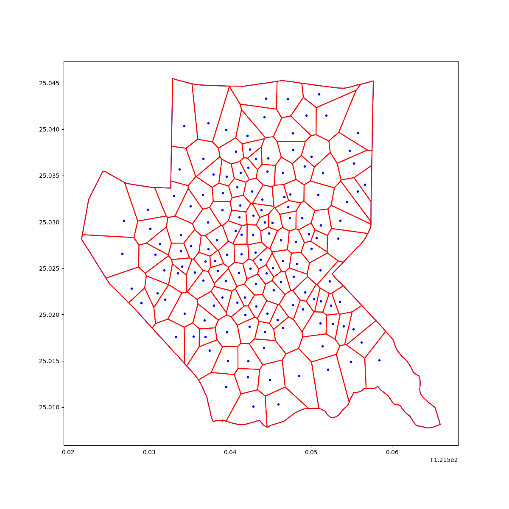

# geo-separation

Using HDBSCAN and Voronori algorithm to create your own spatial polygon.

| sample | cluster | voronoi | final |
| --- | --- | --- | --- |
|  |  |  |  |

## Data Requirement

- polygon:  take the Taiwan open data district polygon ([鄉鎮市區界線(TWD97經緯度)](https://data.gov.tw/dataset/7441)) as example. 
- samples:  generate the sample in multi-normal distribution.

Because of the distribution, samples may leads to few cluster. Try to fit in your own dataset and check the density.

## Algorithm

What we doing here is spatial seperation by samples (e.g. population, age, ...). We expect to get the output of polygon.

### `HDBSCAN` - clustering

1. Divide the grids by a fixed area (optioanl)
    - if you want to keep the local partial information, use thie method to downsample.
2. Apply HDBSCAN for each grid and calc the centroid (downsamping)
3. Use the last run centroid as the inputs, apply HDBSCAN again
4. The hot spot of given ops district will be the final run centroid

### `Voronoi` - spatial seperation

1. Apply voronoi alogrithm to get the polygon by each centroid
2. Handle the infinite boundary with ops district polygon
3. Handls the Multipolygon (ops district polygon mat seperate original polygon)
4. Using GeoPandas to collect the ops_district, polygon and point